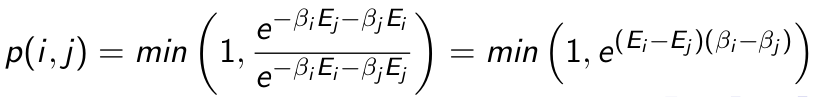
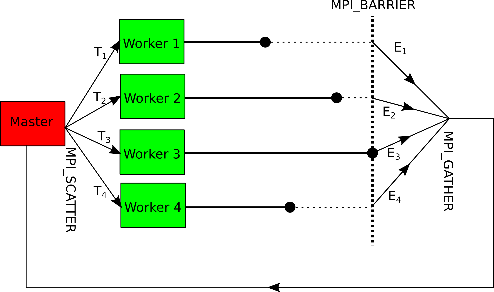
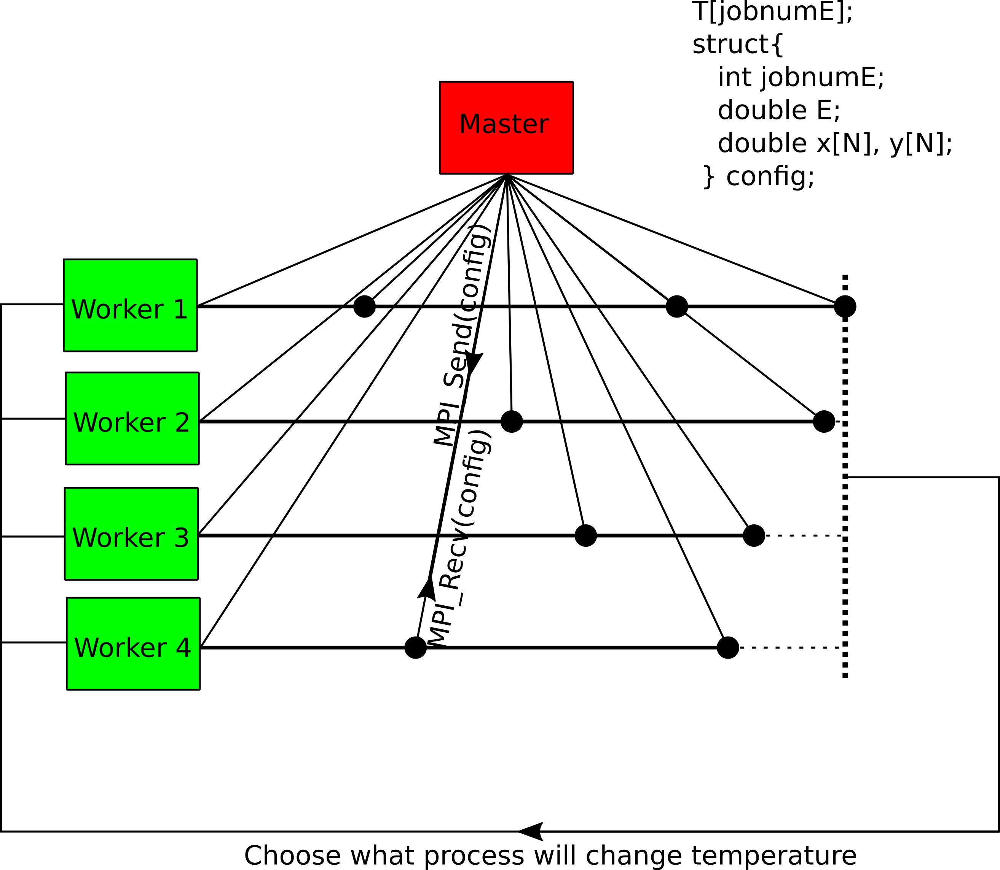
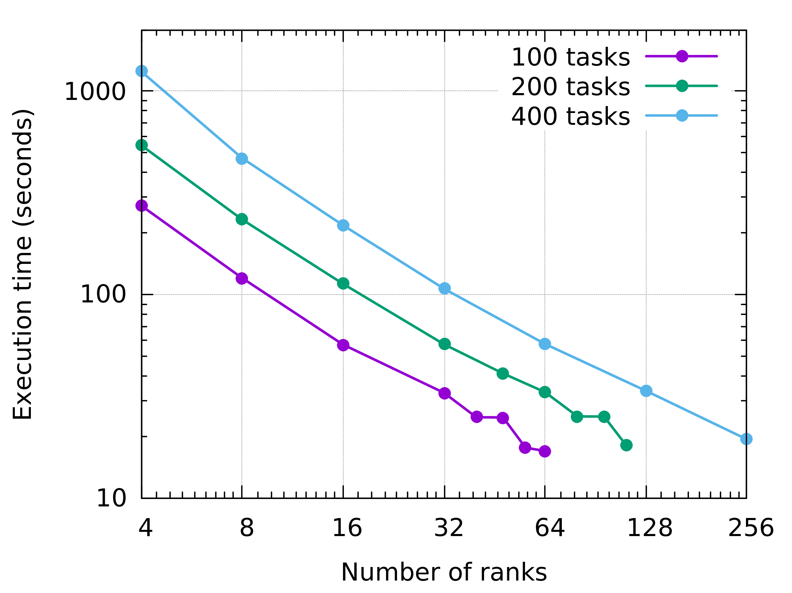
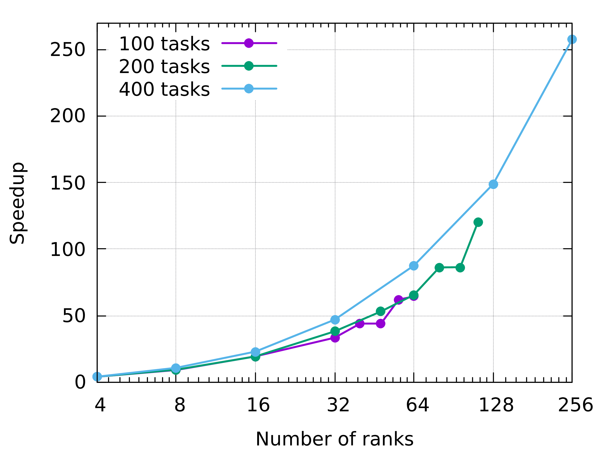
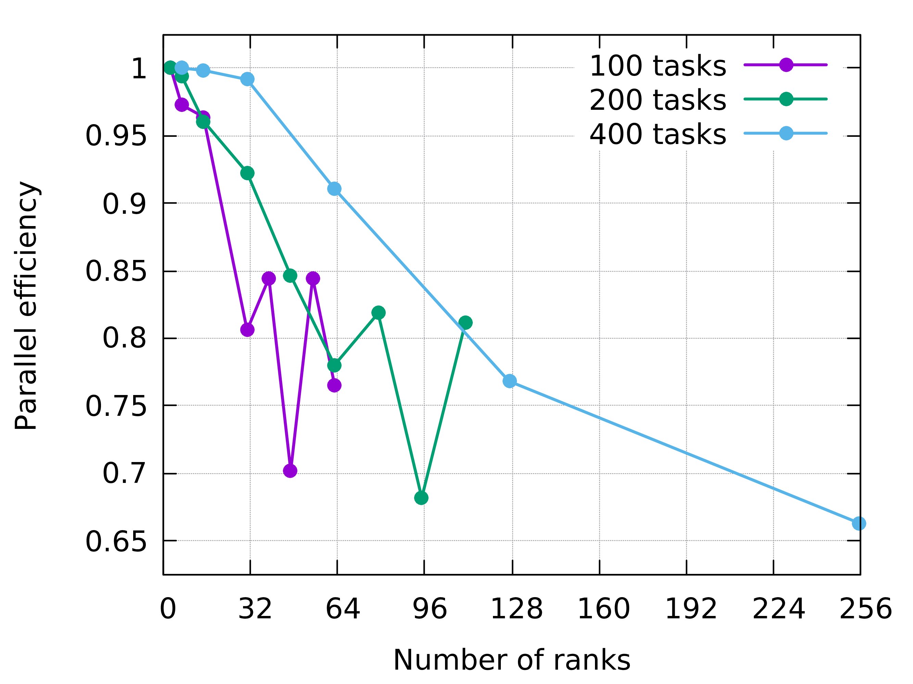

# Parallel Tempering in MPI

Parallel Tempering is a simulation technique aimed to equilibrate a ensemble of configurations at different temperatures. The main ideia of the algorithm is exchange the temperature between two configurations in an attempt to minimize the free energy of the two. So we can use the Boltzmann weight to calculate the probability of the exchange:

  

## To use:

To use this code, substitute in every place that have a `...` the things that are necessary depending on your purpose and model.

So, it's just compile the .c using the `mpicc` wrapper to get the executable and run in a cluster with slurm using the syntax that is on the script `sbatch job.sh`. You can run in a unique computer too, simulating multiples cores using `mpirun --oversubscribe -n #cores a.out`.

## partempMPI_taskFarm.c
	
This code is the simplest implementation of Parallel Tempering technique, it run one temperature per core, carrying out a load imbalance, because some process has to wait by the others in a MPI_BARRIER.

  

## partempMPI_loadBalance_tag.c

This code is a implementation of Parallel Tempering technique that avoids the load imbalance existent when a unique temperature is simulated per core. In addition, this implementation permites run Parallel Tempering of more temperatures than the number of disponibilized cores with a simple master-worker communication protocol.

### Benchmarking

Quickly measuring the time of a small simulation, we can simply benchmark the algorithm. Below we can see measures of the running time of the simulation for different number of cores.

## Future Ideas

Try to make a decentralized version of this algorithm, just with the workers exchanging the temperatures, without the need of the master.

Based on: http://cacs.usc.edu/education/cs653/Li-ParallelTempering-ParComp09.pdf

## Acknowledgment

I'd would like to thank all the participants and teachers at the 2º Latin American School on Parallel Programming for HPC for their great partnership and for giving me a very pleasant and enjoyable learning environment.
